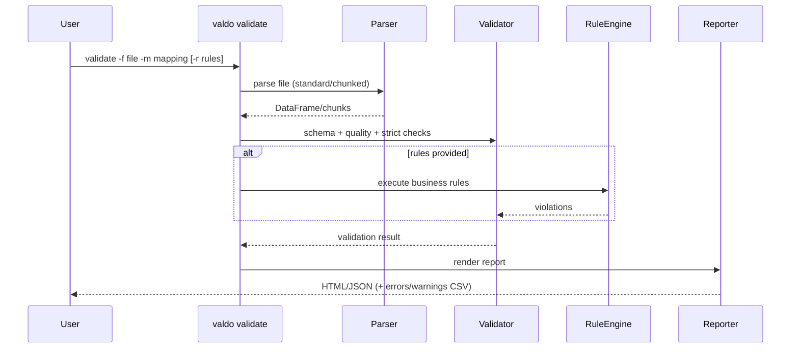
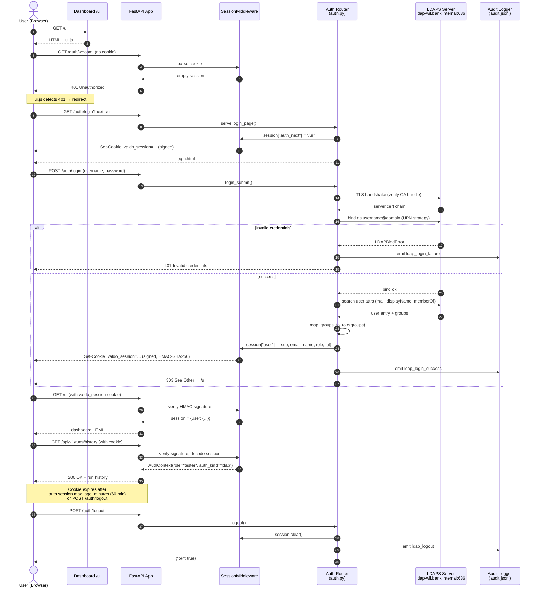

# Architecture

## High-Level Architecture

```mermaid
flowchart TD
    U[Users / CI / Schedulers] --> C[CLI: valdo]
    U --> A[REST API: FastAPI]
    U --> WEB[Web UI\n/ui single-page app]
    WEB --> A

    BATCH[Java Batch Process] -->|trigger file| WATCH[valdo watch]
    BATCH -->|webhook| RUNS[/api/v1/runs/trigger]

    C --> CMDS[Command Layer\nsrc/commands/*]
    A --> API[API Routers\nsrc/api/routers/*]

    WATCH --> SVCS[Service Layer\nsrc/services/*]
    RUNS --> SVCS

    CMDS --> SVCS
    API --> SVCS

    CMDS --> WF[Workflow Engine\nsrc/workflows/*]

    SVCS --> P[Parsing Layer\nformat detector + parsers]
    SVCS --> V[Validation Layer\nenhanced + chunked + rules]
    SVCS --> M[Mapping Layer\nconverter + parser + schemas]
    SVCS --> D[Database Layer\nOracle connection/extractor/reconcile]
    SVCS --> R[Reporting Layer\nrenderers + adapters + contracts]
    SVCS --> G[GE Layer\ncheckpoint1 config-driven]

    P --> DF[(DataFrame)]
    V --> DF
    M --> DF
    D --> DF
    DF --> R
    DF --> G

    R --> OUT[Reports\nHTML + JSON + CSV]
    G --> OUT
```

## Validation Flow



## LDAP Login Flow

Valdo supports two authentication modes that coexist on the same endpoints:

- **API key** — service-to-service callers send `X-API-Key` on every request.
- **LDAP session** — interactive users log in with corporate credentials via `/auth/login`. The server binds to LDAPS, then issues a signed session cookie that is trusted on subsequent requests.

When both are present, the session cookie wins. LDAP mode is activated by setting `auth.enabled: true` in `config/ui.yml`.

### Components involved

| Component | File | Responsibility |
|---|---|---|
| Login router | `src/api/routers/auth.py` | `GET /auth/login`, `POST /auth/login`, `POST /auth/logout`, `GET /auth/whoami` |
| LDAP binder | `src/api/auth_ldap.py` | LDAPS bind, attribute search, group → role mapping |
| Session middleware | Starlette `SessionMiddleware` (registered in `src/api/main.py`) | Signs/verifies cookie via `VALDO_SESSION_SIGNING_KEY` |
| Auth dependency | `src/api/auth.py` | `verify_session_or_api_key` — accepts either credential |
| Audit logger | `src/utils/audit_logger.py` | Writes `ldap_login_*` events to `logs/audit.jsonl` |
| Login form | `src/reports/static/login.html` | HTML form, `fetch()`-based POST with inline error handling |
| Dashboard JS | `src/reports/static/ui.js` | Calls `/auth/whoami` on load; redirects to `/auth/login` on 401 |

### Sequence diagram



### Key security properties

- **TLS enforced**: `src/api/auth_ldap.py` refuses non-LDAPS URIs; `ssl.CERT_REQUIRED` validates the LDAP server cert against the configured CA bundle.
- **Signed cookies**: `SessionMiddleware` uses HMAC-SHA256 with `VALDO_SESSION_SIGNING_KEY`. Tampered cookies fail signature verification and the user falls back to unauthenticated.
- **Fail-closed on missing key**: `src/api/main.py` raises `RuntimeError` and refuses to start when `auth.enabled: true` and the signing key is absent.
- **Filter injection guard**: `_escape_ldap_filter()` (RFC 4515) sanitizes username before interpolation into the LDAP search filter.
- **Generic error messages**: invalid username and invalid password both return `"Invalid credentials"` to prevent user enumeration.
- **Open-redirect guard**: `_safe_next()` accepts only same-site relative paths starting with `/` (and not `//`).
- **Absolute session lifetime**: `iat` timestamp is checked on every request against `max_age_minutes`; no sliding refresh.
- **Compact session payload**: only `sub`, `email`, `name`, `role`, `iat` are stored in the cookie — never the full LDAP groups list, to keep the cookie under the 4 KB browser limit.

### Configuration knobs (config/ui.yml → auth)

| Key | Purpose |
|---|---|
| `enabled` | Master switch for the LDAP login flow |
| `mode` | Currently only `"ldap"` is implemented |
| `ldap.server_uri` | Must start with `ldaps://` |
| `ldap.bind_strategy` | `"upn"` (no service account) or `"search_then_bind"` (requires service account) |
| `ldap.user_search_base` | OU root for the post-bind attribute search |
| `ldap.user_search_filter` | Typically `(sAMAccountName={username})` for AD |
| `ldap.ca_cert_path` | PEM bundle containing intermediate + root CA |
| `ldap.group_role_map` | Maps AD group CN → valdo role (`admin`, `mapping_owner`, `tester`) |
| `session.cookie_secure` | `true` for HTTPS prod, `false` for local HTTP dev |
| `session.cookie_samesite` | `"lax"` for normal flows, `"strict"` for higher security |
| `session.max_age_minutes` | Absolute session lifetime (default 60) |
| `session.signing_key_env` | Env var name holding the HMAC signing key |

### Audit events

All login activity is appended to `logs/audit.jsonl` (configurable via `AUDIT_LOG_PATH`):

- `ldap_login_success` — fields: `sub`, `role`, `groups`, `triggered_by="web_ui"`
- `ldap_login_failure` — fields: `username`, `reason`, `triggered_by="web_ui"`
- `ldap_logout` — fields: `sub`, `triggered_by="web_ui"`

## Core Modules
- `src/main.py` — CLI wiring
- `src/commands/` — thin command handlers
- `src/services/` — shared business workflows (CLI/API parity)
- `src/workflows/` — shared workflow orchestration engine for scripts
- `src/parsers/` — format detection and parsing
- `src/parsers/enhanced_validator.py` — standard validation
- `src/parsers/chunked_validator.py` — chunked validation
- `src/validators/` — business and field validators
- `src/database/` — Oracle connectivity and extraction
- `src/contracts/` — typed config contracts (pipeline/workflow)
- `src/reports/` — unified report rendering/adapters/contracts
- `src/reporters/` + `src/reporting/` — backward-compatible shims (deprecated)
- `src/quality/gx_checkpoint1.py` — Great Expectations checkpoint integration

**Web UI**: Single-page HTML UI at `/ui`. Vanilla JS calls existing API endpoints. No framework or build step. Run history logged to `reports/run_history.json`.

**API Check Testing**: `api_check` test type in YAML suites calls external HTTP endpoints via `httpx` and asserts on status code and JSON response. Integration tests in `tests/integration/` cover all FastAPI endpoints using `TestClient`.

**CI/CD Integration**: `valdo watch` polls a trigger directory for `.trigger` files dropped by the Java batch process and runs the matching suite automatically. `POST /api/v1/runs/trigger` provides a webhook for pipeline-based triggering. Templates in `ci/` for GitLab CI and Azure DevOps.

**Row tracking**: All parsers append `__source_row__` (1-indexed physical line number) to output DataFrames. This column is preserved through the comparison and reporting layers and stripped before Oracle operations.

## Mode parity — one validation core across surfaces

Valdo runs in several modes (ad-hoc CLI/UI, integration/UAT batch via the
pipeline, and CI/CD), but they must exercise **one** validation/comparison core,
not divergent re-implementations ("one engine, four modes"). The convergence is
**guarded by a test** (`tests/unit/test_mode_parity.py`, arch-review R-04a) so a
surface cannot silently drift onto a parallel path:

- The **API** router (`src/api/routers/files.py`) and the **pipeline** runner
  (`src/pipeline/etl_pipeline_runner.py`) both route validation through the
  shared services `run_validate_service` and `run_multi_record_validate_service`.
  Inside the runner, step dispatch goes through a small step-type → handler
  **registry** (`ETLPipelineRunner._step_handlers`, arch-review R-11) rather
  than a type-switch: a new step type is added by registering an entry plus a
  handler, not by editing a branch chain. The registry's keys are the
  authoritative list of recognised step types, and an unknown type still raises
  `ValueError` enumerating them.
- `run_multi_record_validate_service` is a thin wrapper over the shared
  `MultiRecordValidator` core — the same core the **CLI** multi-record command
  and the harness multi-record report (`scripts/render_multi_record_html.py`)
  use directly.
- **Known, pinned divergence:** the single-record **CLI** path
  (`run_validate_command`) drives `EnhancedFileValidator`/`ChunkedFileValidator`
  directly (the same primitives the service composes) rather than
  `run_validate_service`. The parity test records this so a *new* third path is
  caught immediately; routing the CLI through the service for full parity is
  tracked as R-04b.

## Configuration plane

Valdo is driven by several distinct config artifacts (mapping JSON, rules
JSON/CSV, umbrella YAML, reconcile YAML, source YAML, `paths.yml`, pipeline
YAML), each with its own schema authority and load-time validation strength.
The single authority enumerating every artifact → schema owner →
load-validated status is
[`docs/CONFIG_SCHEMA_REGISTRY.md`](CONFIG_SCHEMA_REGISTRY.md) (arch-review
R-10a). Consult it before adding or changing a config format.

## DB-to-file comparison engines

Valdo has **two** complementary (not redundant) paths that compare
database-derived data against a file: `compare_db_to_file`
(`src/services/db_file_compare_service.py`, the `db_compare` pipeline step /
ad-hoc CLI / UI tab) and `db_truth_comparator.reconcile`
(`scripts/e2e_lib/db_truth_comparator.py`, the L2b SQL-truth gate). They answer
different questions, from different truth sources, for different consumers. The
single authority describing each engine's purpose, inputs, truth source,
when-to-use, and whether convergence is intended is
[`docs/DB_COMPARE_ENGINES.md`](DB_COMPARE_ENGINES.md) (arch-review R-09).

## Design Principles
- Mapping-driven processing (no hardcoded file layouts)
- Fail-fast exit codes for CI correctness
- Memory-safe chunked processing for large files
- Service-first reuse to prevent CLI/API drift
- Human + machine outputs for operations and automation
